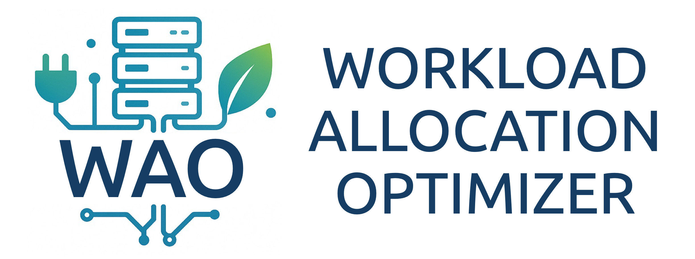

# WAO for Kubernetes



Welcome to the WAO for Kubernetes project!

<!-- START doctoc generated TOC please keep comment here to allow auto update -->
<!-- DON'T EDIT THIS SECTION, INSTEAD RE-RUN doctoc TO UPDATE -->

- [Overview](#overview)
- [Architecture](#architecture)
  - [`wao-core`: CRDs and controllers](#wao-core-crds-and-controllers)
  - [`wao-metrics-adapter`: Exposes environmental metrics](#wao-metrics-adapter-exposes-environmental-metrics)
  - [`wao-scheduler`: Custom scheduler plugin](#wao-scheduler-custom-scheduler-plugin)
  - [`wao-loadbalancer`: Energy-efficient load balancing](#wao-loadbalancer-energy-efficient-load-balancing)
- [Getting Started](#getting-started)
  - [1. Prerequisites](#1-prerequisites)
  - [2. Install WAO Components](#2-install-wao-components)
  - [3. Configure NodeConfigTemplate](#3-configure-nodeconfigtemplate)
  - [4. Use WAO Scheduler](#4-use-wao-scheduler)
  - [5. Use WAO Load Balancer](#5-use-wao-load-balancer)
- [Contribution](#contribution)
- [Acknowledgements](#acknowledgements)
- [License](#license)

<!-- END doctoc generated TOC please keep comment here to allow auto update -->

## Overview

WAO (Workload Allocation Optimizer) is a software-based approach to reduce datacenter servers' power consumption, this repository contains its Kubernetes implementation, which is designed to optimize pod placement (kube-scheduler) and traffic distribution (kube-proxy) in a bare metal Kubernetes cluster to minimize overall power consumption.

WAO in essence predicts the additional power consumption that each node would incur when a new workload (pod or inbound traffic) is added, then selects the node with the smallest predicted increase. This is achieved by considering each node's power consumption characteristics from its CPU load and environmental factors (inlet temperature and static pressure differences) with a prediction model, and implementing them to kube-scheduler and kube-proxy.

Experiments on commodity CPU-based servers running AI workloads have demonstrated up to a 30% reduction in overall power consumption, showcasing how a software-based method can make a tangible impact on data center energy efficiency.

**Additional Resources**

- WAO models and optimization code are available at [`waok8s/optimization`](https://github.com/waok8s/optimization).
- Presentation at Kubernetes Meetup Tokyo #66 (日本語) [[Video]](https://www.youtube.com/live/RpaC3AG2bc4?t=2490s) [[Slides]](https://speakerdeck.com/ebiiim/waok8s-k8sjp66)
- Performance evaluation: [Shunsuke Ise et al., "Scalability and Versatility of Energy-Aware Workload Allocation Optimizer (WAO) on Kubernetes", IEEE JCC 2025, Tucson, AZ, USA, 2025.](https://ieeexplore.ieee.org/document/11124162)
- Experiments in datacenter: [Ying-Feng Hsu et al., "Sustainable Data Center Energy Management through Server Workload Allocation Optimization and HVAC System", IEEE Cloud Summit 2024, Washington DC, USA, 2024.](https://ieeexplore.ieee.org/document/10630908)
- WAO: [R. Douhara et al., "Kubernetes-based Workload Allocation Optimizer for Minimizing Power Consumption of Computing System with Neural Network," 2020 International Conference on Computational Science and Computational Intelligence (CSCI), Las Vegas, NV, USA, 2020.](https://ieeexplore.ieee.org/document/9458062)

## Architecture

This project leverages Kubernetes extensions—such as custom controllers, Custom Resource Definitions (CRDs), custom metrics APIs, and scheduler plugins—to integrate seamlessly with existing Kubernetes environments.

This integrated repository brings together multiple modules, each maintained as a separate Go module. Detailed information for each module is provided in its own README.


### [`wao-core`](/wao-core/): CRDs and controllers

This is the central component of WAO. It provides the CRDs (such as NodeConfig and NodeConfigTemplate) and controllers required to manage power consumption prediction. It handles the configuration for each node (e.g. Redfish endpoints, sensor APIs, and prediction models) so that other WAO components can utilize this data.

### [`wao-metrics-adapter`](/wao-metrics-adapter/): Exposes environmental metrics

This module implements [custom metrics API](https://github.com/kubernetes/design-proposals-archive/blob/main/instrumentation/custom-metrics-api.md) for WAO. It collects environmental sensor data (like inlet temperature and static pressure difference) from each node and exposes them via the Custom Metrics API. This allows the scheduler plugin and other components to access real-time metrics for power consumption prediction.

### [`wao-scheduler`](/wao-scheduler/): Custom scheduler plugin

This component extends Kubernetes’ scheduling capabilities by providing custom scheduler plugins. The WAO Scheduler selects the optimal node for a Pod based on predicted power consumption increases, using plugins such as a MinimizePower plugin (which scores nodes based on the smallest power increase) and a PodSpread plugin to avoid excessive concentration of Pods from the same application.

### [`wao-loadbalancer`](/wao-loadbalancer/): Energy-efficient load balancing

This module enhances service load balancing by extending [kube-proxy nftables mode](https://github.com/kubernetes/enhancements/blob/master/keps/sig-network/3866-nftables-proxy/README.md) with energy‑efficient weight-based policies.


## Getting Started

> [!NOTE]
> Each module has its own setup and build instructions, so we only provide a general introduction here.

### 1. Prerequisites

You only need a Kubernetes cluster to test the components (kind is suitable for this purpose). To use the functionality, you will need:

- Redfish-enabled servers
- Power consumption prediction models
- Static pressure difference sensors and APIs

### 2. Install WAO Components

Deploy Components to Your Cluster

```bash
# install wao-core
kubectl apply -f https://github.com/waok8s/waok8s/releases/download/wao-core/v1.31.0/wao-core.yaml
# install wao-metrics-adapter
kubectl apply -f https://github.com/waok8s/waok8s/releases/download/wao-metrics-adapter/v1.31.0/wao-metrics-adapter.yaml
# install wao-scheduler
kubectl apply -f https://github.com/waok8s/waok8s/releases/download/wao-scheduler/v1.31.0/wao-scheduler.yaml
# install wao-loadbalancer
kubectl apply -f https://github.com/waok8s/waok8s/releases/download/wao-loadbalancer/v1.31.0/wao-loadbalancer.yaml
```

### 3. Configure NodeConfigTemplate
    
Group your nodes by their hardware characteristics and create a NodeConfigTemplate for each group. This template will be used to create NodeConfig objects for each node.

```yaml
apiVersion: node.waok8s.github.io/v1beta1
kind: NodeConfigTemplate
metadata:
  name: test-nodes
  namespace: wao-system
spec:
  nodeSelector:
    matchLabels:
      node.kubernetes.io/instance-type: "test-node"
  template:
    nodeName: "" # the controller will fill this value
    metricsCollector:
      inletTemp:
        type: Fake
        endpoint: ""
        fetchInterval: 15s
      deltaP:
        type: Fake
        endpoint: ""
        fetchInterval: 15s
    predictor:
      powerConsumption:
        type: Fake
        endpoint: ""
```

This is a simple test configuration. See README in [`wao-core`](/wao-core/) for more details.

### 4. Use WAO Scheduler
    
Specify the custom scheduler in your Pod manifests.
```yaml
spec:
  schedulerName: "wao-scheduler"
```
See README in [`wao-scheduler`](/wao-scheduler/) for more details.

### 5. Use WAO Load Balancer

Specify the service proxy in your Service manifests.
```yaml
metadata:
  labels:
    service.kubernetes.io/service-proxy-name: wao-loadbalancer
```
See README in [`wao-loadbalancer`](/wao-loadbalancer/) for more details.

## Contribution

Any contribution is welcome! If you encounter bugs or have feature requests, please open an Issue on GitHub. For code contributions, submit a Pull Request.
Each module's README contains more detailed information, so please refer to those when working on a specific component.

## Acknowledgements

This work is supported by the New Energy and Industrial Technology Development Organization (NEDO) under its "Program to Develop and Promote the Commercialization of Energy Conservation Technologies to Realize a Decarbonized Society" ([JPNP21005](https://www.nedo.go.jp/english/activities/activities_ZZJP_100197.html)).

## License

Copyright 2021-2025 [Osaka University](https://www.osaka-u.ac.jp/), [Bitmedia Inc.](https://bitmedia.co.jp/), [NEC Corporation](https://www.nec.com/), [Neutrix Cloud Japan Inc.](https://www.neutrix.co.jp/), [Shinohara Electric Co., Ltd.](https://www.shinohara-elec.co.jp)

Licensed under the Apache License, Version 2.0 (the "License");
you may not use this file except in compliance with the License.
You may obtain a copy of the License at

    http://www.apache.org/licenses/LICENSE-2.0

Unless required by applicable law or agreed to in writing, software
distributed under the License is distributed on an "AS IS" BASIS,
WITHOUT WARRANTIES OR CONDITIONS OF ANY KIND, either express or implied.
See the License for the specific language governing permissions and
limitations under the License.
